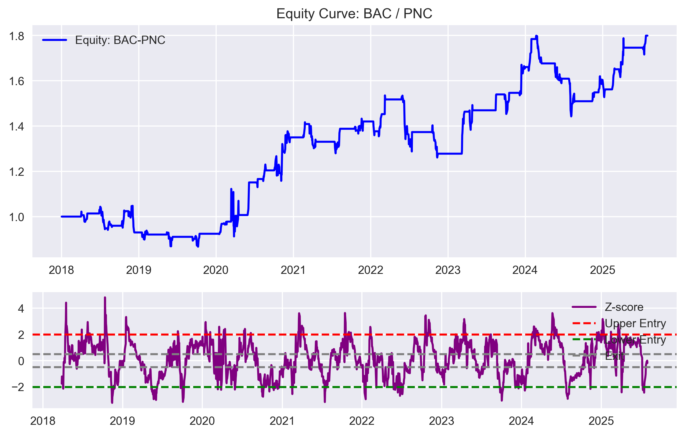
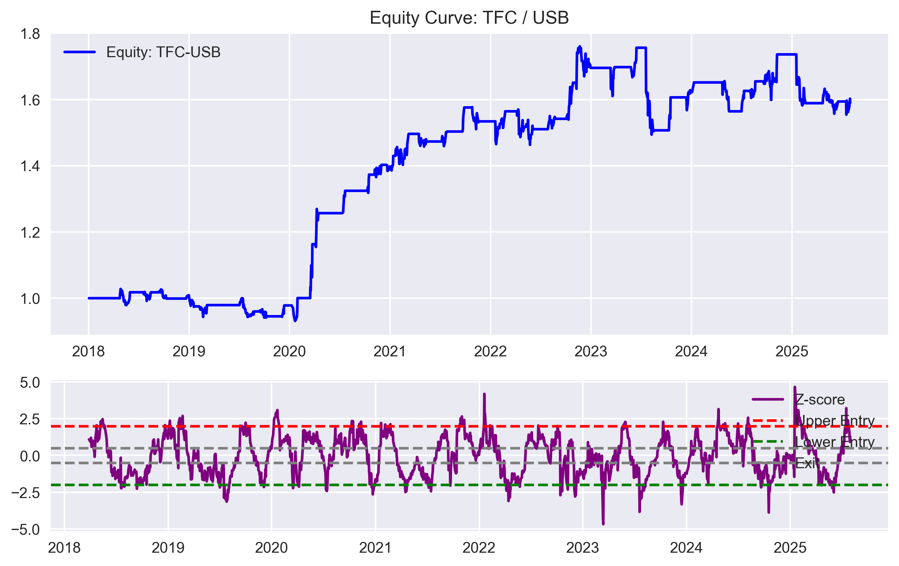
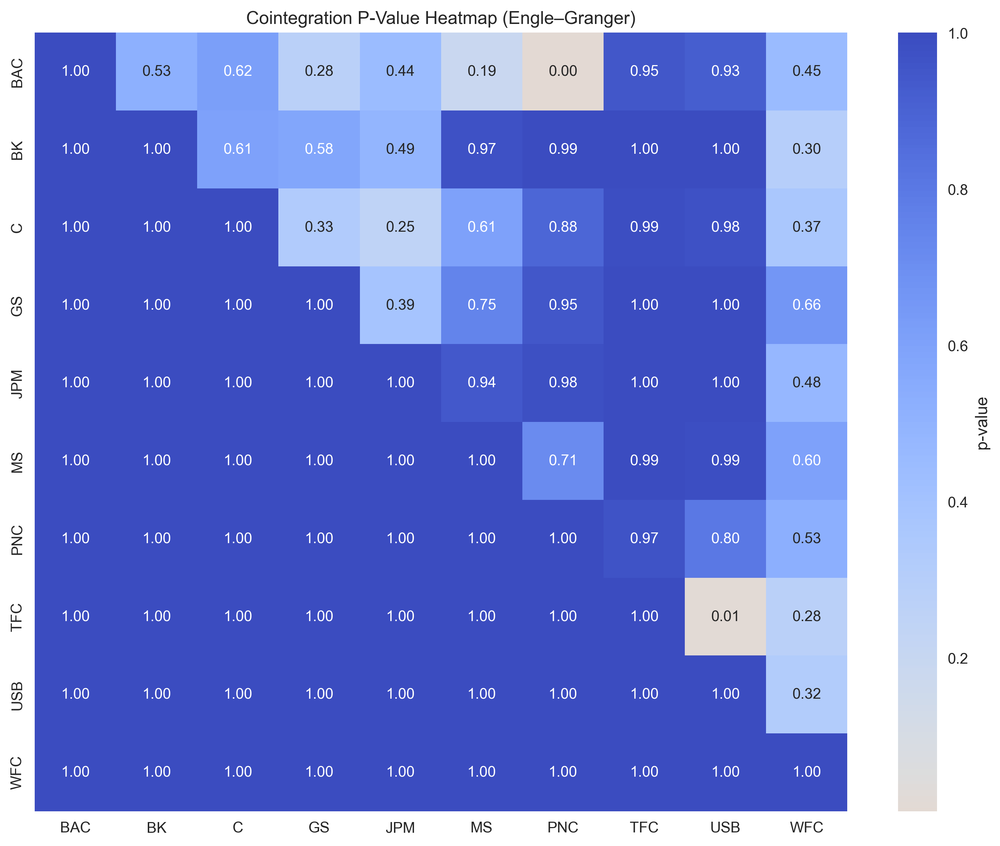

# 📈 Statistical Arbitrage — Pairs Trading with Cointegration

This project implements a **statistical arbitrage strategy** using the **Engle–Granger cointegration test** to identify mean-reverting stock pairs and trade their spread.  

It demonstrates skills in **time-series econometrics, trading strategy design, backtesting, and reporting**.

---

## 🔍 Project Overview

- **Data Source**: Daily adjusted close prices pulled via yfinance api
- **Methodology**:
  1. Download sector stocks (banks in this demo).
  2. Test for cointegration using `statsmodels.tsa.stattools.coint`.
  3. Construct spread for pairs, compute z‑score.
  4. Trading rules:
     - Enter **long spread** if z < -2.
     - Enter **short spread** if z > +2.
     - Exit when z ≈ 0.
  5. Backtest on single pairs and as a multi‑pair portfolio.
- **Evaluation Metrics**:
  - Annualized Return
  - Volatility
  - Sharpe Ratio
  - Maximum Drawdown
  - Win Rate

---

## 📊 Results & Insights

**Backtest Period:** 2018‑01‑02 to 2025‑07‑31  
**Universe:** 10 U.S. bank stocks - ["JPM", "BAC", "WFC", "C", "GS", "MS", "USB", "PNC", "TFC", "BK"] 

### Z‑Score Example (BAC-PNC)

### Z‑Score Example (TFC–USB)

### Cointegration Heatmap

---

## 📑 Full Research Report
For a detailed breakdown of the methodology, performance metrics, and full set of plots, see the complete report:  
[📄 Quant Research Report (PDF)](Quant_Research_Report.pdf)
### Key Findings
- **Cointegrated Pairs Found:** 2 (TFC‑USB, BAC‑PNC)  
- **Best Performing Pair:** TFC‑USB with a Sharpe ratio of **0.87** and modest positive return of **+3.2% annualized**.  
- **Weak Pair:** BAC‑PNC underperformed with negative returns and Sharpe ratio of **-0.17**.  
- **Portfolio Performance (Equal‑weighted):**
  - Annualized Return: **~1.2%**
  - Volatility: **2.9%**
  - Sharpe Ratio: **0.41**
  - Max Drawdown: **‑6.2%**
  - Win Rate: **4.5%**

### Interpretation
- The **TFC‑USB pair** displayed consistent mean‑reversion and generated reasonable excess return, albeit with limited magnitude.  
- The **BAC‑PNC pair** was cointegrated historically but produced negative performance, suggesting instability in the spread during the test period.  
- At the **portfolio level**, although returns were positive, risk‑adjusted performance (Sharpe 0.41) was relatively weak compared to industry benchmarks, highlighting the challenges of implementing pairs trading naïvely without refinements.

### Limitations
- **Transaction Costs:** Not included in this backtest; they could further erode profitability.  
- **Small Sample of Pairs:** Only 2 statistically significant pairs detected among 10 tickers; broader universes may yield more opportunities.  
- **Stationarity Instability:** Historical cointegration relationships can break down over time, particularly in crisis periods.

### Future Work
- Incorporate more **sectors/universes** for robust pair detection.    
- Include **transaction costs and slippage** for realistic PnL estimation.

